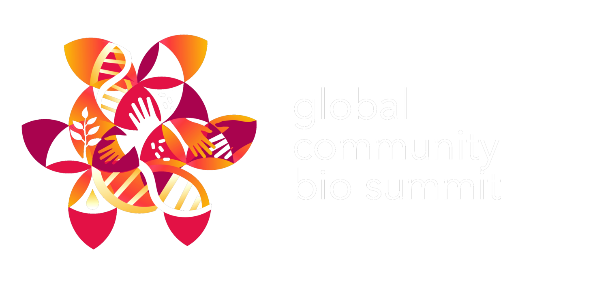

At the 2019 [Community Bio Summit](https://www.biosummit.org/) there was a discussion of setting up a regional page and list to discuss community bio labs in Canada.

please feel free to add yourself to that [mailing list](https://lists.uvic.ca/mailman/listinfo/communitybio)

As an indication of the goals of the community bio movement, here is a graphic made by Ananda describing the shared statment of purpose arising from the Global Community Bio Summit version 2.0

